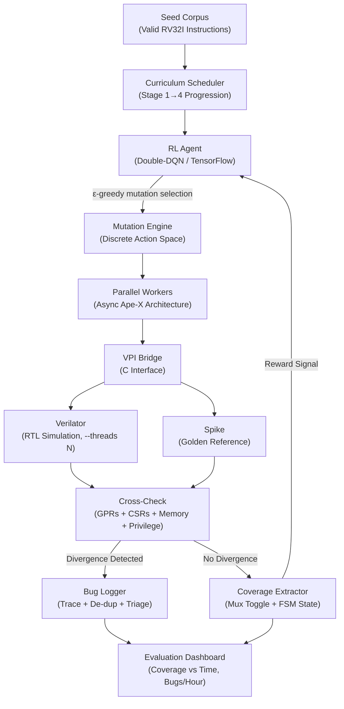

# Reinforcement Learning Hardware Fuzzer Implementation Plan

To implement a Reinforcement Learning (RL) hardware fuzzer, you are fundamentally bridging systems programming with applied machine learning. You are building a system where the "game environment" is a simulated processor, the "actions" are instruction mutations, and the "score" is the hardware logic coverage.

Here is the detailed, step-by-step implementation plan to build this architecture from scratch.

## Phase 0: Toolchain Setup & Verification

Before any RL logic is written, you must verify that your entire simulation pipeline produces consistent, deterministic results. False positives from toolchain misconfigurations will poison training data.

* **Install & Version-Lock:** Pin exact versions of Verilator, the Spike ISA Simulator, and the RISC-V GNU toolchain (riscv64-unknown-elf-gcc). Version drift between these tools is a common source of phantom divergences.
* **Baseline Validation:** Compile and run a known-good suite of RISC-V compliance tests (e.g., the official riscv-arch-test suite) through both Verilator and Spike. Every single test must produce identical register and memory states across both simulators before proceeding.
* **Determinism Check:** Run the same test binary through Verilator multiple times. If the output register dumps are not bit-identical across runs, your simulation has non-deterministic behavior (often caused by uninitialized signals in Verilog) that must be resolved first.

## Phase 1: Compiling the Hardware Environment

You cannot perform high-speed fuzzing on raw Verilog files directly; the simulation overhead is too massive. The HDL must be compiled into a fast, executable model.

* **The Target & Golden Model:** Select an open-source RISC-V core (like the Rocket Core) as your Device Under Test (DUT). You will also need a trusted software emulator (like the Spike ISA Simulator) to act as your "Golden Reference" for differential testing.
* **The Toolchain:** Use Verilator to synthesize the target RTL into a cycle-accurate C++ simulation.
* **The Bridge:** Your RL agent will likely be written in Python, but your simulation is in C++. You will need to write a custom Verilog Procedural Interface (VPI) in C to bridge these environments. This C-interface will inject mutated 32-bit instructions directly into the C++ simulator's instruction memory and extract the internal register states cycle-by-cycle.
* **The Seed Corpus:** Before the RL agent can learn meaningful mutations, it needs a starting point. Build a curated seed corpus containing all 47 base RV32I ISA opcodes with valid register encodings. Include arithmetic (ADD, SUB), memory (LW, SW), branch (BEQ, BNE, JAL), and system (ECALL, EBREAK) instructions. Without valid seeds, the vast majority of random mutations will be rejected as illegal instructions, wasting simulation cycles and producing zero coverage signal for the agent to learn from.

## Phase 2: Defining the RL Problem

To use Deep Q-Learning (DQL), you must translate the mechanics of hardware fuzzing into a mathematical framework of States, Actions, and Rewards.

* **The State (S):** The state must be richer than just the raw instruction. Represent it as a composite feature vector containing:
  * The instruction's **binary field decomposition** — opcode (7 bits), rd (5 bits), funct3 (3 bits), rs1 (5 bits), rs2 (5 bits), funct7 (7 bits) — rather than the flat 32-bit encoding. This gives the agent structural awareness of which fields control what behavior.
  * The **current coverage bitmap** — a binary vector indicating which multiplexer toggles and FSM states have already been hit. This is critical; without it, the agent has no memory of what it has already explored and will waste cycles re-discovering known paths.
* **The Action (A):** The action space must be explicitly **discrete and finite** for DQL to function. Define a bounded set of mutation operators:
  * Bit-flip at position `i` (32 distinct actions for a 32-bit instruction)
  * Randomize a register field (rs1, rs2, or rd — 3 actions)
  * Replace the opcode with an adjacent valid opcode (cycle through the RV32I opcode table)
  * Swap funct3 or funct7 fields with alternative valid encodings
  * Arithmetic perturbation of the immediate field (+1, -1, set to max, set to zero)
  * This yields a well-defined action space of approximately 40–50 discrete actions.
* **The Reward (R):** Standard software code coverage does not work in hardware. Your VPI must calculate coverage using multiple complementary metrics:
  * **Multiplexer Toggle Coverage:** If an action toggles a multiplexer that has not been flipped before, the environment returns a high positive reward.
  * **FSM State Coverage:** Track whether the processor's control unit has visited every architectural state — pipeline stalls, branch mispredictions, exception handling paths, and privilege mode transitions. This is a more semantically meaningful metric than raw toggle counts and significantly strengthens the publishability of the work.
  * **Negative Reward:** Assign a small negative reward for mutations that produce illegal instructions (immediately trapped) to discourage the agent from wasting cycles on trivially invalid inputs.

## Phase 3: Building the Deep Q-Network (DQN)

The brain of your fuzzer will be an agent that predicts which mutations lead to the deepest hardware coverage.

* **The Model:** Use TensorFlow to build a feed-forward neural network. The network takes the state (the instruction field features concatenated with the coverage bitmap) as input and outputs a Q-value for every possible mutation action.
* **The Optimization:** The network updates its weights by optimizing the Bellman equation to maximize expected future coverage:  
  `Q(s,a) = r + γ max_a' Q(s', a')`
* **Double-DQN:** Vanilla DQN is known to overestimate Q-values, which causes unstable training — especially problematic with large action spaces (40+ mutations). Use **Double-DQN** instead: decouple action selection (using the online network) from action evaluation (using a periodically-updated target network). This significantly stabilizes convergence. Consider **Dueling DQN** as a further refinement — it separates the learned state value from the action advantage, which is particularly useful here since many mutation actions may be equally poor, and the agent benefits from learning the intrinsic value of being in a high-coverage region independently of the specific mutation applied.
* **Exploration Strategy (ε-Greedy Decay):** The agent must balance exploration (trying new mutations) with exploitation (repeating mutations that yielded high coverage). Start with ε = 1.0 (fully random) and decay linearly to ε = 0.05 over the first N training episodes. Without this decay, the agent either explores forever (degenerating into a random fuzzer) or exploits too early (getting stuck in a local coverage plateau).
* **Memory Restraints:** Running Verilator, the Spike emulator, and an active TensorFlow agent concurrently is highly resource-intensive. When orchestrating this on a system with 16GB of RAM, restrict the replay buffer size in your DQN and limit the batch size during asynchronous training. If the replay buffer grows too large, the system will swap to disk, and your simulation speed will collapse.

## Phase 4: The Differential Fuzzing Loop

With the architecture set up, the execution loop runs continuously:

* **Generate:** The TensorFlow agent selects a mutation action based on the ε-greedy policy (exploit the highest Q-value or explore randomly) and applies it to a seed instruction.
* **Execute:** The mutated instruction is sent via the VPI to both the Verilator RTL simulation and the Spike emulator.
* **Cross-Check:** After execution, compare the full architectural states of both simulators. This comparison must include:
  * **General-Purpose Registers (GPRs):** All 32 registers (x0–x31).
  * **Control and Status Registers (CSRs):** Especially `mstatus`, `mcause`, `mepc`, and `mtval` — these reveal exception-triggering bugs that GPR comparison alone would miss.
  * **Memory State:** If the instruction writes to memory, compare the affected memory regions across both simulators.
  * If Spike says a register should hold `0x00` but Verilator holds `0xFF`, you have found a hardware bug.
* **Feedback:** The VPI extracts the multiplexer toggle coverage and FSM state coverage from Verilator and sends it back to the TensorFlow agent as the reward, updating the neural network for the next cycle.

## Phase 5: Logging, De-duplication & Bug Triage

Detecting divergences is only half the problem. Without proper logging and triage, you will drown in duplicate reports of the same underlying bug.

* **Full Trace Logging:** For every divergence detected, automatically dump:
  * The exact mutated instruction (hex encoding + decoded assembly).
  * The full instruction trace leading up to the divergence (last N instructions).
  * The register and memory diff between Verilator and Spike.
  * The current coverage bitmap snapshot at the time of divergence.
* **De-duplication:** The same root-cause RTL bug will often trigger across hundreds of different instruction mutations. Implement stack-trace hashing (hash the divergence signature: which registers diverged + the opcode class) to cluster duplicate reports. Only surface unique bug signatures for manual analysis.
* **Severity Triage:** Not all divergences are equal. Classify them:
  * **Critical:** Memory write divergence or CSR corruption — indicates a potential security-relevant logic flaw.
  * **High:** GPR divergence on arithmetic or branch instructions — indicates incorrect ALU or control logic.
  * **Low:** Divergence only in undefined/implementation-specific behavior — may be a simulation artifact rather than a real RTL bug. Cross-reference with the RISC-V ISA specification to confirm.

## Phase 6: Evaluation & Benchmarking

For publishability, you must demonstrate that the RL-guided approach outperforms existing methods. This requires a rigorous experimental comparison.

* **Baselines to Compare Against:**
  * **Random Fuzzing:** Generate uniformly random 32-bit instruction words with no learning. This is your lower bound — if your RL agent cannot beat random, the ML component adds no value.
  * **Coverage-Guided Fuzzing (AFL-style):** Implement a traditional genetic-algorithm fuzzer that retains inputs which increase coverage but has no learned mutation strategy. This is the standard industry baseline.
  * **State-of-the-Art RL Fuzzers:** Reproduce or compare against results from GenHuzz (USENIX 2025) and RLFuzz (2026) on the same DUT if possible. If their exact code is unavailable, compare coverage curves from their published results.
* **Key Metrics to Track:**
  * **Coverage vs. Time:** Plot multiplexer toggle coverage and FSM state coverage as a function of wall-clock time for each approach. The RL agent should show a steeper curve, reaching higher coverage faster.
  * **Unique Bugs Found per Hour:** Raw bug count over time, after de-duplication.
  * **Time-to-First-Bug:** How quickly each approach finds its first real divergence.
  * **Training Overhead:** Report the time and compute cost of training the DQN versus the coverage benefit gained. If training takes 48 hours but only provides a 5% coverage improvement over AFL-style, the trade-off needs honest discussion.
* **Statistical Rigor:** Run each configuration at least 5 times with different random seeds and report mean ± standard deviation. Single-run results are not publishable.

## Phase 7: Training Optimizations — Curriculum Learning

Deep Q-Networks converge faster when the task difficulty is gradually increased. Apply curriculum learning to the fuzzing problem.

* **Stage 1 — Arithmetic Only:** Restrict the seed corpus to pure arithmetic instructions (ADD, SUB, SLL, SLT, XOR, OR, AND) and their immediate variants. The pipeline has minimal control-flow complexity in this stage, so the agent learns basic mutation-to-coverage relationships quickly.
* **Stage 2 — Add Branches:** Introduce branch instructions (BEQ, BNE, BLT, BGE, JAL, JALR). The pipeline now experiences stalls, flushes, and mispredictions. The agent must learn that mutating branch targets and conditions produces high-reward coverage events.
* **Stage 3 — Add Memory Operations:** Introduce loads and stores (LW, SW, LB, SB). This stage stresses the memory subsystem, cache logic, and load-store unit — often where the most subtle RTL bugs hide.
* **Stage 4 — Full ISA + System Instructions:** Unlock ECALL, EBREAK, CSR instructions, and fence operations. This is the hardest tier, introducing privilege transitions and pipeline serialization.
* **Transfer Between Stages:** When transitioning between stages, carry forward the trained network weights. Do not restart from scratch — the agent's understanding of arithmetic mutation quality should transfer to more complex instruction classes.

## Phase 8: Scaling with Multi-Core Parallelism

Single-threaded simulation is the bottleneck. Parallelism can dramatically increase throughput without proportional memory cost.

* **Verilator Threading:** Verilator natively supports multi-threaded simulation via the `--threads N` flag. Compile the DUT with 4–8 threads to exploit instruction-level parallelism in the RTL simulation itself.
* **Parallel Environment Instances:** Run multiple independent simulation instances (each with its own Verilator + Spike pair) as separate processes. Each instance executes mutations from a shared mutation queue and reports coverage results back to a centralized replay buffer.
* **Asynchronous Training:** The DQN training loop does not need to wait for every simulation to complete. Use an asynchronous architecture where:
  * Worker processes generate (state, action, reward, next_state) tuples and push them to a shared replay buffer.
  * A single learner process samples mini-batches from the buffer and updates the network weights.
  * Workers periodically pull the latest weights from the learner.
  * This is analogous to the Ape-X DQN architecture (Horgan et al., 2018) and scales near-linearly with the number of workers.
* **RAM Budget:** Each Verilator instance consumes approximately 500MB–2GB depending on the DUT size. On a 16GB machine, limit yourself to 4 parallel workers. On a 64GB workstation or cloud instance, scale to 16–32 workers for serious fuzzing campaigns.

## Phase 9: Privilege Escalation Fuzzing

The highest-impact class of hardware vulnerabilities involves privilege escalation — where user-mode code gains unauthorized access to machine-mode resources. This deserves explicit fuzzing attention.

* **The Attack Model:** The RISC-V privilege specification defines three privilege levels: Machine (M), Supervisor (S), and User (U). A correctly implemented core must prevent U-mode code from reading or writing M-mode CSRs, accessing M-mode memory regions, or manipulating the `mstatus` register to elevate its own privilege.
* **Targeted Seed Sequences:** Construct multi-instruction seed sequences designed to probe privilege boundaries:
  * Attempt to read `mtvec`, `mepc`, or `mscratch` from U-mode (should trap).
  * Execute `MRET` from U-mode (should trap).
  * Write to PMP (Physical Memory Protection) configuration registers from U-mode (should trap).
  * Mutate the `mstatus.MPP` field via CSR write instructions to attempt privilege elevation.
* **Differential Check Enhancement:** For privilege tests, the cross-check must verify not just register values but also:
  * Did both Spike and Verilator correctly raise an illegal-instruction exception?
  * Is the privilege level after execution identical in both simulators?
  * If one simulator traps and the other does not, that is a **critical severity** privilege escalation bug.
* **Why This Matters for Publication:** Privilege escalation bugs in processor cores are the hardware equivalent of a kernel exploit. Demonstrating that your RL fuzzer can autonomously discover a privilege boundary violation — without being explicitly programmed to look for one — is a strong, high-impact result that differentiates your work from coverage-only approaches.

## Architecture Overview



---

# Advanced Extensions: H100 GPU Scaling

> These sections are independent of the core implementation plan above. They describe how access to high-end GPU hardware changes the ceiling of what is achievable and publishable.

## H100 Scaling Strategy

Access to an H100 (80GB HBM3) fundamentally changes the performance ceiling. The bottleneck in the core plan is simulation throughput — the RL agent can only learn as fast as Verilator can simulate. The H100 breaks this bottleneck at every level.

### Distributed Ape-X Architecture

The Ape-X DQN (Horgan et al., 2018) was designed exactly for this kind of high-throughput RL. In this setup:

* **Actor Workers (CPU):** Spin up 128–256 Docker containers, each running an independent Verilator + Spike simulation pair. Each worker runs its own ε-greedy policy, generates `(state, action, reward, next_state)` experience tuples, and pushes them to a shared **Redis replay buffer** on the host. Workers are stateless — they pull the latest network weights periodically and execute independently.
* **Learner (H100):** A single learner process on the H100 continuously samples large mini-batches (1024–4096) from the Redis replay buffer and updates the DQN weights using batched GPU operations. It pushes updated weights back to workers every N steps.
* **Batched Inference:** Rather than serving one mutation decision at a time, the H100 inference server accepts batches of 256+ pending state queries from all workers simultaneously and returns Q-value vectors in a single forward pass. This brings inference throughput from ~1K/sec (CPU) to ~1M/sec (H100 batched).

### RAM & Container Budget

| Hardware | Verilator Instances | Replay Buffer Size | Training Batch |
|:---|:---|:---|:---|
| 16GB RAM, CPU only | 4 workers | ~50K transitions | 64 |
| 256GB RAM, H100 | 128–256 workers | ~10M transitions | 2048–4096 |
| Cloud (8× H100 node) | 512+ workers | ~50M transitions | 8192+ |

With 10M+ transitions in the replay buffer, the agent encounters rare hardware states (deep pipeline stalls, exception cascades) enough times to reliably learn to target them — something impossible at 50K buffer sizes.

### Population-Based Hyperparameter Search

With H100 compute, train 16–32 agents simultaneously with varied hyperparameters (learning rate, ε decay schedule, network depth, reward shaping weights). Use **Population-Based Training (PBT)** to automatically evolve the best configuration during training, eliminating the need for costly manual hyperparameter tuning runs.

---

## LLM-Guided Seed Generation

This is the most significant H100-specific contribution. Rather than generating seeds by mutating single instructions, use a locally-hosted **code LLM to synthesize semantically meaningful multi-instruction test programs** that are likely to stress specific pipeline behaviors.

### Why Single-Instruction Seeds Are Insufficient

Single instruction fuzzing misses an entire class of bugs that only manifest from **instruction interactions**:

* **Read-After-Write (RAW) hazards:** `ADD x1, x2, x3` followed immediately by `LW x4, 0(x1)` — the load depends on the ALU result not yet written back.
* **Branch misprediction + load-use hazard cascade:** A branch followed by a dependent load creates a compound pipeline flush + stall scenario.
* **CSR write → instruction fetch race:** Writing to `mtvec` immediately before triggering an exception may expose a race in the trap handler logic.
* **Memory ordering bugs:** Store followed by a load to the same address, with a branch in between — tests the store-to-load forwarding logic.

None of these are discoverable by single-instruction mutation alone.

### The LLM Role

Host a **CodeLlama-34B** or **StarCoder2-15B** model locally on the H100 (both fit comfortably in 80GB). Use it in two modes:

* **Structured Prompt Mode:** Give the LLM a description of a pipeline stress scenario and ask it to generate a valid RISC-V assembly sequence:
  ```
  Prompt: "Write a 6-instruction RISC-V RV32I sequence that creates a 
  load-use hazard on register x5, followed by a branch that depends on 
  x5's value, then a store to a memory address computed from x5."
  ```
  The LLM outputs syntactically valid assembly that the fuzzer then uses as a structured seed for RL mutation.

* **Coverage-Conditioned Mode (Novel):** Feed the LLM the current **coverage bitmap** (which FSM states and mux toggles remain unhit) and prompt it to generate sequences specifically likely to reach those unexplored states. This makes the LLM a coverage-aware seed generator — a genuinely novel architectural contribution with no direct precedent in the literature.

### Hybrid LLM + RL Pipeline

```
LLM (CodeLlama-34B on H100)
    ↓  generates structured multi-instruction seeds
Seed Queue (semantically valid programs)
    ↓  feeds
RL Mutation Engine (applies discrete mutations within valid program structure)
    ↓  sends mutated programs
Verilator + Spike (parallel execution)
    ↓  returns coverage signal
RL Agent (learns which mutations of LLM seeds reach new hardware states)
    ↓  coverage bitmap fed back to
LLM (coverage-conditioned next seed generation)
```

This closed loop — where the LLM generates seeds informed by what the RL agent has already covered — is a feedback-driven test synthesis pipeline that has no direct equivalent in the existing hardware fuzzing literature.

### Publication Angle

The paper title becomes significantly stronger:

> *"LLM-Seeded Reinforcement Learning for Coverage-Guided Hardware Fuzzing of RISC-V Processors"*

The contribution claims are:
1. First system combining LLM-generated structured seeds with RL-guided mutation for hardware fuzzing.
2. Coverage-conditioned LLM prompting as a novel seed generation strategy.
3. Privilege escalation as an explicit fuzzing target, discovered autonomously.
4. Demonstrated on open-source RISC-V cores with quantified coverage improvements over random, AFL-style, and single-instruction RL baselines.

This is a **USENIX Security or IEEE S&P submission** if the system finds real bugs.